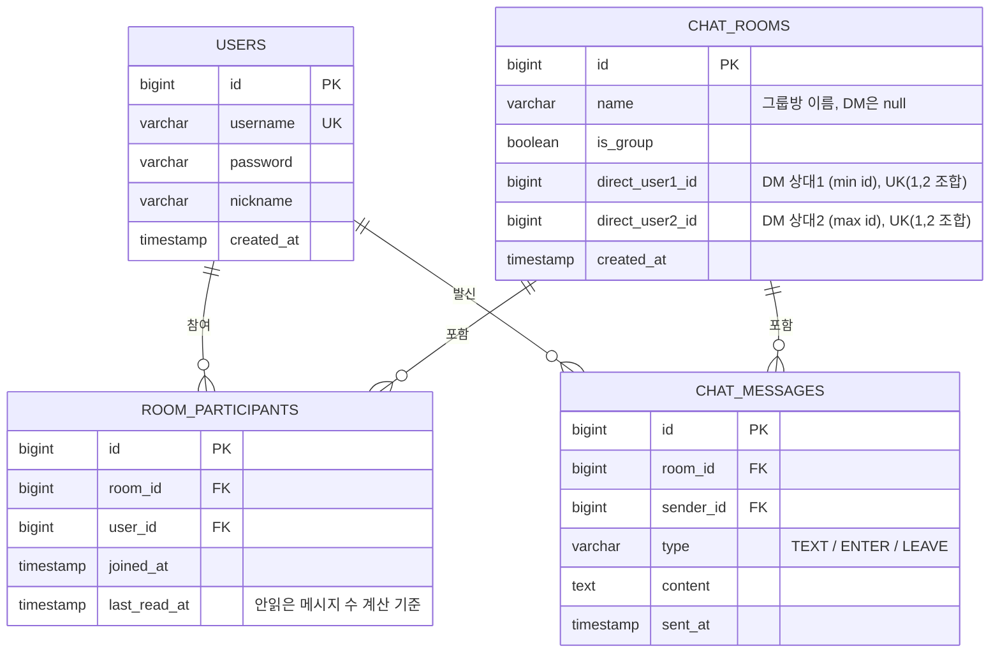

# chat_service

Spring Boot 기반 실시간 채팅 서비스입니다. 그룹 채팅방과 1:1 DM, JWT 인증, STOMP-over-WebSocket 실시간 메시징을 지원합니다.
-- 09/01 하네스 엔지니어링 중지

## 주요 기능

- **인증**: 회원가입/로그인/로그아웃, JWT 발급 및 Redis 기반 토큰 블랙리스트(로그아웃 즉시 무효화)
- **채팅방**: 그룹방 생성, 1:1 DM(동시 생성 요청 시 유니크 제약으로 충돌 방지 후 기존 방 재사용), 그룹방 나가기
- **실시간 메시징**: STOMP-over-WebSocket으로 메시지 전송, 입장/퇴장 알림, 타이핑 인디케이터, 접속자 프레즌스 추적
- **읽음/안읽음**: 방별 마지막 읽은 시각(`lastReadAt`) 기반 안읽은 메시지 수 집계, 방 목록에 마지막 메시지 미리보기 제공
- **메시지 팬아웃**: Redis Pub/Sub으로 여러 서버 인스턴스 간 메시지 브로드캐스트

## 기술 스택

- Java 21, Spring Boot 4.1
- Spring Web MVC, Spring WebSocket(STOMP), Spring Security, Spring Data JPA
- PostgreSQL(영속성), Redis(세션 프레즌스, 토큰 블랙리스트, 메시지 팬아웃)
- JJWT, Thymeleaf(서버사이드 로그인/방 목록 뷰)

## 로컬 실행

```bash
# PostgreSQL, Redis가 별도로 떠 있어야 합니다 (docker-compose 파일 없음)
./mvnw spring-boot:run
```

기본 접속 정보는 `src/main/resources/application.yml` 참고. `REDIS_HOST`/`REDIS_PORT`/`JWT_SECRET` 환경변수로 덮어쓸 수 있습니다.

## ERD



`chat_rooms`는 `(direct_user1_id, direct_user2_id)` 조합에 유니크 제약을 걸어 그룹방(둘 다 null)과 별개로 동일한 두 사용자 간 DM 방이 중복 생성되지 않도록 보장합니다.

## API 개요

| 구분 | 엔드포인트 | 설명 |
| --- | --- | --- |
| REST | `POST /api/auth/signup` | 회원가입 |
| REST | `POST /api/auth/login` | 로그인, JWT 발급 |
| REST | `POST /api/auth/logout` | 로그아웃, 토큰 블랙리스트 등록 |
| REST | `GET /api/rooms` | 내 채팅방 목록(마지막 메시지, 안읽은 수 포함) |
| REST | `POST /api/rooms` | 그룹 채팅방 생성 |
| REST | `POST /api/rooms/dm` | 1:1 DM 방 생성/조회 |
| REST | `GET /api/rooms/{roomId}/messages` | 방 메시지 조회(페이지네이션) |
| REST | `DELETE /api/rooms/{roomId}/participants/me` | 그룹 채팅방 나가기 |
| STOMP | `/app/rooms/{roomId}/send` | 메시지 전송 |
| STOMP | `/app/rooms/{roomId}/enter` | 방 입장 알림 |
| STOMP | `/app/rooms/{roomId}/typing` | 타이핑 인디케이터 |
